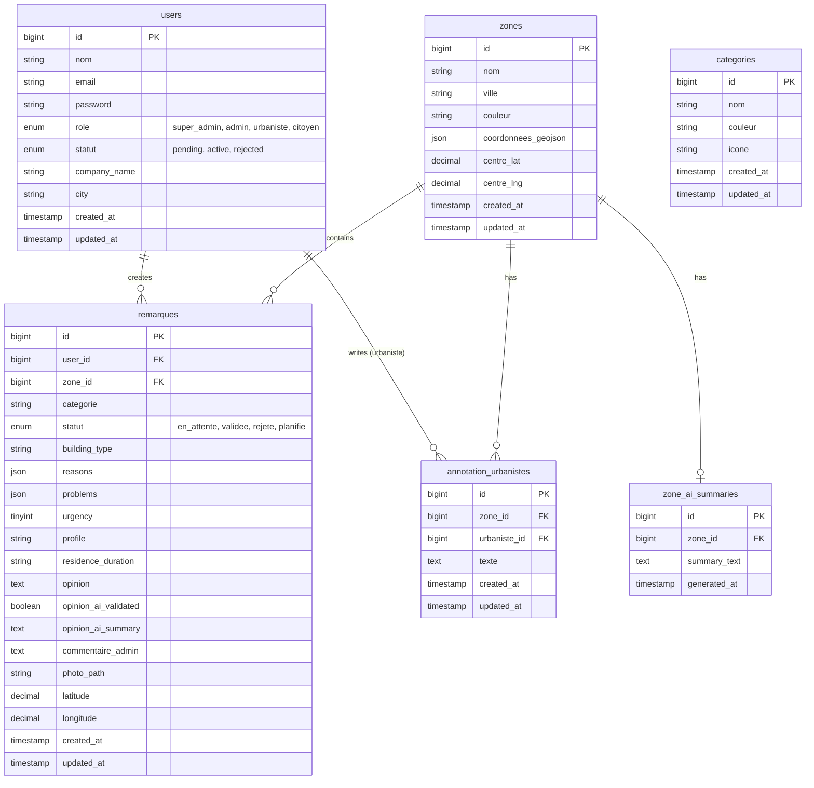

# UrbanMap Backend and Frontend

UrbanMap Maroc is a two-part application: a Laravel-based backend API and a frontend SPA that consumes the API. The backend exposes REST endpoints for zones, annotations, remarks, and user management, while the frontend provides dashboards and interfaces for planning and administration.

## Tech Stack

- Backend: Laravel 12 + PHP 8.2
  - Sanctum for API authentication
  - SQLite (default) or MySQL
- Frontend: A modern SPA (commonly Vue/React with Vite) served separately and consuming the Laravel API
- Database: SQLite by default, with optional MySQL for production
- Version control: Git

## Project Structure

- urbanmap-backend/
  - app/, bootstrap/, config/, database/, routes/, resources/, etc. (Laravel structure)
  - artisan, composer.json, composer.lock
  - vite.config.js (if frontend assets are integrated here)
  - README.md (this file)
- frontend/ (if present)
  - SPA app (Vue/React) that communicates with the Laravel API

Note: The frontend and backend communicate via HTTP. The frontend should be configured to point to the backend API (base URL) as defined in its environment configuration.

## Setup rapide (Frontend + Backend)

### Backend (Laravel API)

1. Install dependencies
   - composer install
2. Configure environment
   - Copy .env.example to .env
   - Update database settings (SQLite by default or MySQL)
3. Generate app key
   - php artisan key:generate
4. Run migrations and seeds
   - php artisan migrate --seed
5. Link storage (for uploads)
   - php artisan storage:link
6. Serve the backend
   - php artisan serve
   - Default URL: http://localhost:8000

Notes:
- If using Laravel Sail or a local PHP server, ensure PHP 8.2 is used.
- Sanctum is configured for SPA authentication. The frontend should request CSRF tokens as needed.

### Frontend (SPA)

1. Navigate to the frontend directory
   - cd frontend
2. Install dependencies
   - npm install (or yarn install)
3. Configure API URL
   - Set the backend base URL in the frontend environment (e.g., VITE_API_BASE_URL or .env.example for the frontend)
4. Start the dev server
   - npm run dev (or npm start, depending on the setup)
5. Access the app
   - Frontend: http://localhost:5173 (or configured port)
   - Backend: http://localhost:8000

## Environment Variables

Backend (.env)
- APP_URL=http://localhost
- DB_CONNECTION=sqlite (or mysql)
- DB_DATABASE=database.sqlite (if using SQLite)
- DB_HOST, DB_PORT, DB_DATABASE, DB_USERNAME, DB_PASSWORD (if using MySQL)
- FRONTEND_URL=http://localhost:5173 (if needed for CORS or redirect rules)

Frontend
- VITE_API_BASE_URL (or equivalent) should point to http://localhost:8000 (backend)
- Other environment-specific values as needed by the frontend framework

## Roles and User Permissions

The app supports multiple user roles with distinct permissions. The exact roles may vary by deployment, but the following model aligns with the endpoints and seeds observed:

- Super Admin
  - Full access to the system
  - Manage users (create, edit, deactivate, assign roles)
  - Manage zones, annotations, remarks, and zone summaries
  - Run migrations, seed data, and maintain configuration
  - Access all admin dashboards and analytics

- Admin
  - Manage zones (create, update, delete)
  - Manage annotations and remarks
  - Approve or reject pending user accounts
  - View system-level dashboards and usage metrics
  - Manage storage links and application configuration

- Urbaniste (Urban Planner)
  - Create and update zones
  - Create and edit annotations related to zones
  - View and possibly generate zone summaries
  - Comment on or review remarks associated with zones

- Regular User / Public User
  - View zones and related data
  - Submit remarks (api/remarques) related to zones
  - Access public endpoints (read-only where appropriate)
  - Authenticate to gain personalized access and submit data as allowed

- Notes
  - The seed account (example) often provides a Super Admin:
    - Email: superadmin@urbanmap.ma
    - Password: super123

## Database Schema

The following Entity-Relationship Diagram represents the core tables for the UrbanMap database:

## API Overview (Main Endpoints)

Auth and Users
- POST /api/register
- POST /api/login
- POST /api/logout
- GET /api/me
- GET /api/users
- GET /api/users/pending
- PATCH /api/users/{user}

Zones and Summaries
- GET /api/zones
- POST /api/zones
- DELETE /api/zones/{zone}
- GET /api/zones/{zone}/annotations
- GET /api/zones/{zone}/summary
- POST /api/zones/{zone}/summary

Annotations
- GET /api/annotations
- POST /api/annotations
- PATCH /api/annotations/{annotation}
- DELETE /api/annotations/{annotation}

Remarques (Remarks)
- GET /api/remarques
- POST /api/remarques
- PATCH /api/remarques/{remarque}

Users and Urbanistes
- GET /api/urbanistes/{urbaniste}/annotations

Misc / Admin Utilities
- php artisan route:list
- php artisan test

Storage
- php artisan storage:link (to link public storage)
## Verification rapide

- php artisan route:list
- php artisan test
- curl -I http://localhost:8000/api/me (after login)
- curl -I http://localhost:8000 (backend root)

## Débogage et dépannage

- Si artisan n’est pas trouvé: assurez-vous d’être dans le répertoire racine de Laravel (urbanmap-backend) et que artisan existe.
- Si le frontend ne peut pas atteindre l’API: vérifiez VITE_API_BASE_URL (ou équivalent) et les CORS settings dans config/cors.php.
- Si les migrations échouent: vérifiez la connexion DB et les versions PHP.
- Vérifiez les logs dans storage/logs/ pour les erreurs en production.

## Bonnes pratiques pour les développeurs

- Garder les dépendances à jour (composer update, npm install).
- Utiliser les commandes Laravel pour vérifier les routes et les tests.
- Documenter les endpoints API et les modèles (ERD) pour faciliter la maintenance.
- Utiliser Sanctum pour les sessions SPA et assurer les protections CSRF pour le frontend.

## Contribuer

- Créez une branche feature/your-feature
- Ajoutez des tests et mettez à jour la documentation
- Faites une pull request avec une description claire

## Remarques finales

Ce README est conçu pour décrire le backend Laravel API et le frontend SPA associées, avec les rôles d’utilisateurs et les flux typiques d’utilisation. Si votre projet a des nuances spécifiques (par exemple des permissions exactes via Gates/Policies, des modèles additionnels, ou des endpoints custom), merci d’ajouter ces détails pour clarifier la sécurité et les flux métier.

